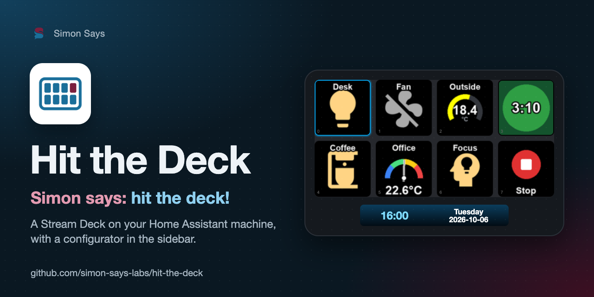

<p align="center"></p>

# Hit the Deck

<p align="center"><b><a href="../README.md#deutsch">🇩🇪 Deutsch</a> · <a href="../README.md#english">🇬🇧 English</a> · <a href="README.fr.md">🇫🇷 Français</a> · <a href="README.it.md">🇮🇹 Italiano</a> · 🇪🇸 Español</b></p>

> **Simon says: hit the deck!** Un Stream Deck conectado a tu equipo de Home Assistant se convierte en un mando a
> distancia para luces, interruptores, escenas, ventiladores y sensores. Asignas las teclas en un configurador del
> panel lateral que las dibuja exactamente como el deck. Hecho para el Stream Deck Neo, mejor aún junto con Track Time.

[](https://my.home-assistant.io/redirect/supervisor_add_addon_repository/?repository_url=https%3A%2F%2Fgithub.com%2Fsimon-says-labs%2Fhit-the-deck)

<p align="center"></p>

## Mejor con Track Time

[Track Time](https://github.com/simon-says-labs/track-time) es un registro de tiempo de trabajo para Home Assistant.
Hit the Deck lo encuentra por sí solo y te da dos teclas para tu jornada laboral:

<p align="center"></p>

| Tecla | Hace |
|---|---|
| Track Time: iniciar / pausar / reanudar | detenido → iniciar, en marcha → pausar, en pausa → reanudar; muestra el tiempo trabajado hoy |
| Track Time: detener | termina la jornada laboral, también desde una pausa |

## Funciones

- **Teclas de entidad** con icono y color según el estado de la entidad, en cuatro vistas: icono completo,
  icono + valor, Gauge y Meter. Una pulsación ejecuta cualquier acción, una secuencia de acciones o un preajuste
  de ventilador.
- **Páginas**, que se cambian con teclas o con los dos puntos táctiles del Neo.
- **Barra de información** (info bar) del Stream Deck Neo: hora, fecha, estados de entidades y texto, con degradados
  y plantillas listas para usar.
- **Configurador en el panel lateral** con vistas previas en directo, galería de iconos (Material Design Icons, con
  búsqueda en cinco idiomas), perfiles, exportación e importación. Los cambios llegan al deck al instante.
- **Se atenúa de noche** mientras una entidad de luz que elijas esté apagada.
- **Se recupera tras reinicios USB** junto con la vigilancia de la aplicación.
- **Cinco idiomas**: inglés, alemán, francés, italiano, español.

## Instalación en Home Assistant

1. Haz clic en el botón de arriba, o añade `https://github.com/simon-says-labs/hit-the-deck` como repositorio en la
   tienda de aplicaciones, en **Configuración → Aplicaciones**.
2. Conecta el Stream Deck al equipo de Home Assistant.
3. Instala **Hit the Deck**, activa **Vigilancia** y **Mostrar en el panel lateral**, e inícialo.
4. Opcional: instala [Track Time](https://github.com/simon-says-labs/track-time) para las teclas de tiempo.

Requisitos: Home Assistant OS o Supervised en un equipo de 64 bits (`aarch64` o `amd64`), por ejemplo una
Raspberry Pi 4 o 5. Todas las opciones se describen en [DOCS.md](../hit_the_deck/DOCS.md) (en inglés).

## Independiente: en un ordenador

Hit the Deck también funciona en un ordenador Mac, Windows o Linux al que esté conectado el Stream Deck. En ese caso
necesita un token de acceso de larga duración, y un pequeño asistente crea la conexión contigo:

```bash
pip install -r standalone/requirements.txt   # además hidapi, ver la documentación de python-elgato-streamdeck
python3 standalone/connect.py                # una sola vez
python3 standalone/run.py                    # configurador en http://127.0.0.1:8099
```

`connect.py` comprueba la dirección de Home Assistant, abre en el navegador la página de seguridad de tu perfil,
donde creas el token, lee el token pegado sin mostrarlo, lo verifica con Home Assistant y lo guarda en el llavero del
sistema. El token nunca acaba en un archivo de este proyecto, en un registro ni en la pantalla.
`connect.py --forget` lo elimina. La biblioteca USB nativa se instala según la
[guía de instalación de python-elgato-streamdeck](https://python-elgato-streamdeck.readthedocs.io/en/stable/pages/backend_libusb_hidapi.html).

## Seguridad

- Dentro de Home Assistant no hay que crear ningún token: el Supervisor le da a la aplicación su acceso.
- El configurador solo responde al ingress de Home Assistant (en modo independiente: solo 127.0.0.1).
- La aplicación solicita permisos de hardware USB para abrir el Stream Deck; [SECURITY.md](../SECURITY.md) explica
  por qué y cómo informar de vulnerabilidades.

## Desarrollo

```bash
python3 -m venv .venv && .venv/bin/pip install pillow pyyaml aiohttp websockets keyring
.venv/bin/python -m unittest discover -s tests   # no hace falta ningún Stream Deck
.venv/bin/python tools/demo.py                   # el configurador con entidades inventadas
```

Consulta [CONTRIBUTING.md](../CONTRIBUTING.md). Cambios: [hit_the_deck/CHANGELOG.md](../hit_the_deck/CHANGELOG.md).

## Licencia

[MIT](../LICENSE) © 2026 Simon Eckmiller · publicado por [Simon Says](https://github.com/simon-says-labs).
Componentes de terceros: [THIRD_PARTY_NOTICES.md](../THIRD_PARTY_NOTICES.md).

Este es un proyecto independiente. No está afiliado a Elgato ni a Home Assistant ni cuenta con su respaldo. Stream
Deck y Home Assistant son marcas de sus respectivos propietarios.

<p align="right"><a href="#hit-the-deck">↑</a></p>
