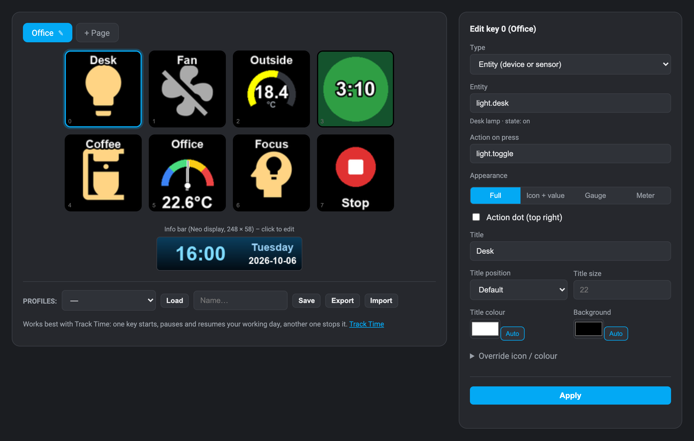
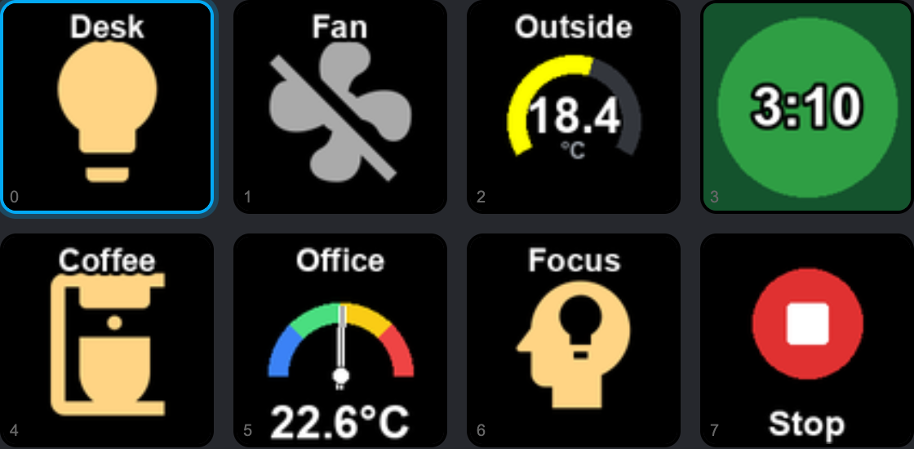

<p align="center"></p>

# Hit the Deck

<p align="center"><b><a href="../README.md#deutsch">🇩🇪 Deutsch</a> · <a href="../README.md#english">🇬🇧 English</a> · 🇫🇷 Français · <a href="README.it.md">🇮🇹 Italiano</a> · <a href="README.es.md">🇪🇸 Español</a></b></p>

> **Simon says: hit the deck!** Un Stream Deck branché sur votre machine Home Assistant devient une télécommande pour
> les lumières, interrupteurs, scènes, ventilateurs et capteurs. Vous affectez les touches dans un configurateur de la
> barre latérale, qui les dessine exactement comme le deck. Conçu pour le Stream Deck Neo, idéal avec Track Time.

[](https://my.home-assistant.io/redirect/supervisor_add_addon_repository/?repository_url=https%3A%2F%2Fgithub.com%2Fsimon-says-labs%2Fhit-the-deck)

<p align="center"></p>

## Idéal avec Track Time

[Track Time](https://github.com/simon-says-labs/track-time) est un outil de suivi du temps de travail pour Home
Assistant. Hit the Deck le détecte tout seul et vous donne deux touches pour votre journée de travail :

<p align="center"></p>

| Touche | Action |
|---|---|
| Track Time : démarrer / pause / reprendre | arrêté → démarrer, en cours → pause, en pause → reprendre ; affiche le temps travaillé aujourd'hui |
| Track Time : arrêter | termine la journée de travail, même depuis une pause |

## Fonctionnalités

- **Touches d'entité** avec icône et couleur selon l'état de l'entité, en quatre affichages : icône pleine,
  icône + valeur, Gauge et Meter. Un appui déclenche n'importe quelle action, une suite d'actions ou un préréglage
  de ventilateur.
- **Pages**, changées par des touches ou par les deux points tactiles du Neo.
- **Barre d'info** (info bar) du Stream Deck Neo : heure, date, états d'entités et texte, avec dégradés et modèles
  prêts à l'emploi.
- **Configurateur dans la barre latérale** avec aperçus en direct, galerie d'icônes (Material Design Icons,
  recherche en cinq langues), profils, export et import. Les modifications arrivent immédiatement sur le deck.
- **Baisse la luminosité la nuit** tant qu'une entité lumière de votre choix est éteinte.
- **Se rétablit après une réinitialisation USB** avec l'aide du chien de garde de l'application.
- **Cinq langues** : anglais, allemand, français, italien, espagnol.

## Installation dans Home Assistant

1. Cliquez sur le bouton ci-dessus, ou ajoutez `https://github.com/simon-says-labs/hit-the-deck` comme dépôt dans la
   boutique d'applications, sous **Paramètres → Applications**.
2. Branchez le Stream Deck sur la machine Home Assistant.
3. Installez **Hit the Deck**, activez **Chien de garde** et **Afficher dans la barre latérale**, puis démarrez-le.
4. Facultatif : installez [Track Time](https://github.com/simon-says-labs/track-time) pour les touches de temps.

Prérequis : Home Assistant OS ou Supervised sur une machine 64 bits (`aarch64` ou `amd64`), par exemple un
Raspberry Pi 4 ou 5. Chaque option est décrite dans [DOCS.md](../hit_the_deck/DOCS.md) (en anglais).

## Autonome : sur un ordinateur

Hit the Deck fonctionne aussi sur un ordinateur Mac, Windows ou Linux auquel le Stream Deck est branché. Il lui faut
alors un jeton d'accès longue durée, et un petit assistant établit la connexion avec vous :

```bash
pip install -r standalone/requirements.txt   # plus hidapi, voir la documentation de python-elgato-streamdeck
python3 standalone/connect.py                # une seule fois
python3 standalone/run.py                    # configurateur sur http://127.0.0.1:8099
```

`connect.py` vérifie l'adresse de Home Assistant, ouvre dans le navigateur la page de sécurité de votre profil, où
vous créez le jeton, lit le jeton collé sans l'afficher, le vérifie auprès de Home Assistant et l'enregistre dans le
trousseau du système. Le jeton n'atterrit jamais dans un fichier de ce projet, dans un journal ni à l'écran.
`connect.py --forget` le supprime. La bibliothèque USB native s'installe selon le
[guide d'installation de python-elgato-streamdeck](https://python-elgato-streamdeck.readthedocs.io/en/stable/pages/backend_libusb_hidapi.html).

## Sécurité

- Dans Home Assistant, aucun jeton n'est à créer : le Supervisor donne son accès à l'application.
- Le configurateur ne répond qu'à l'ingress de Home Assistant (en autonome : uniquement 127.0.0.1).
- L'application demande des droits d'accès au matériel USB pour ouvrir le Stream Deck ; [SECURITY.md](../SECURITY.md)
  explique pourquoi et comment signaler des vulnérabilités.

## Développement

```bash
python3 -m venv .venv && .venv/bin/pip install pillow pyyaml aiohttp websockets keyring
.venv/bin/python -m unittest discover -s tests   # aucun Stream Deck nécessaire
.venv/bin/python tools/demo.py                   # le configurateur avec des entités fictives
```

Voir [CONTRIBUTING.md](../CONTRIBUTING.md). Modifications : [hit_the_deck/CHANGELOG.md](../hit_the_deck/CHANGELOG.md).

## Licence

[MIT](../LICENSE) © 2026 Simon Eckmiller · publié par [Simon Says](https://github.com/simon-says-labs).
Composants tiers : [THIRD_PARTY_NOTICES.md](../THIRD_PARTY_NOTICES.md).

Ceci est un projet indépendant. Il n'est ni affilié à Elgato ou Home Assistant, ni soutenu par eux. Stream Deck et
Home Assistant sont des marques de leurs propriétaires respectifs.

<p align="right"><a href="#hit-the-deck">↑</a></p>
